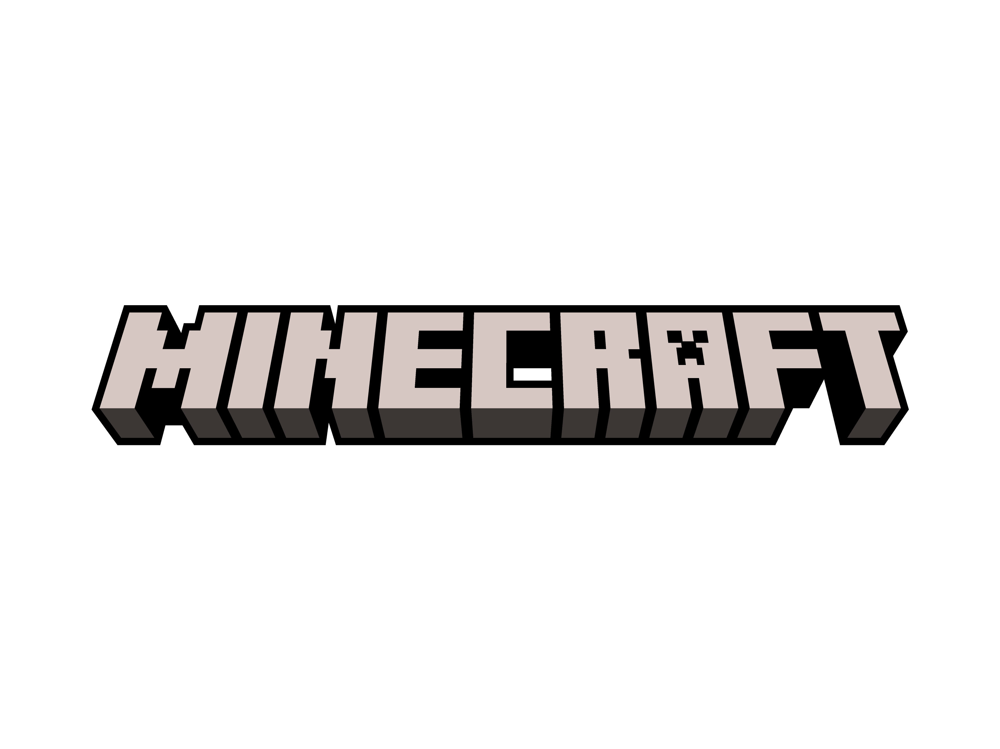

# Final Project game server

## apa itu game server?
game server adalah server yang digunakan untuk menjalankan permainan secara online

## requirement
1. ubuntu server 20.04
2. minecraft java edition

## serverice yang digunakan
1. openjdk
2. wget
3. screen

## update progress
1. 17 oktober install openjdk
2. 17 oktober install wget
3. 17 oktober install screen
4. 3 november install minecraft server
